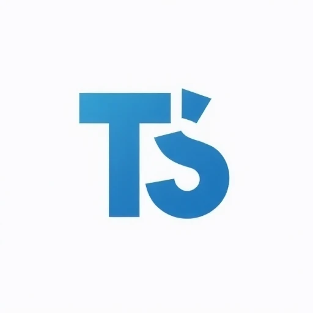
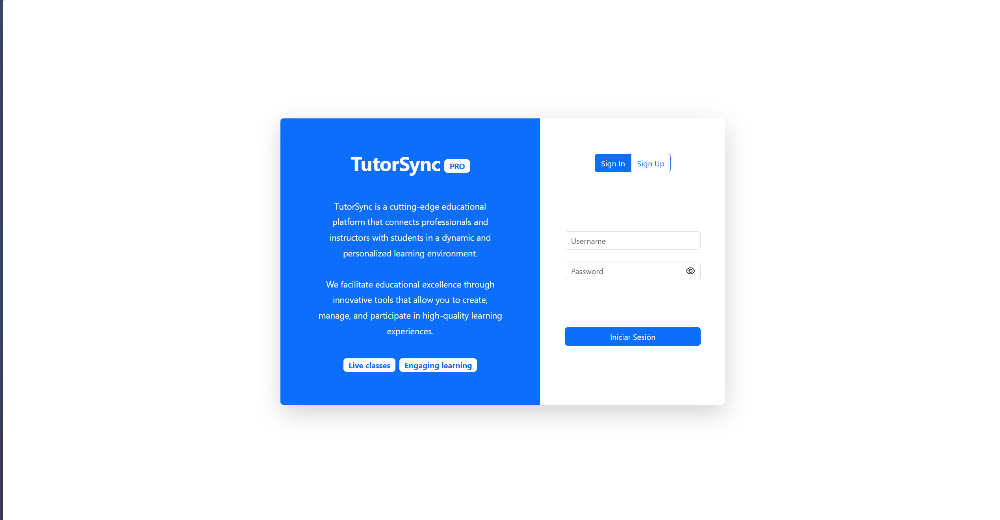
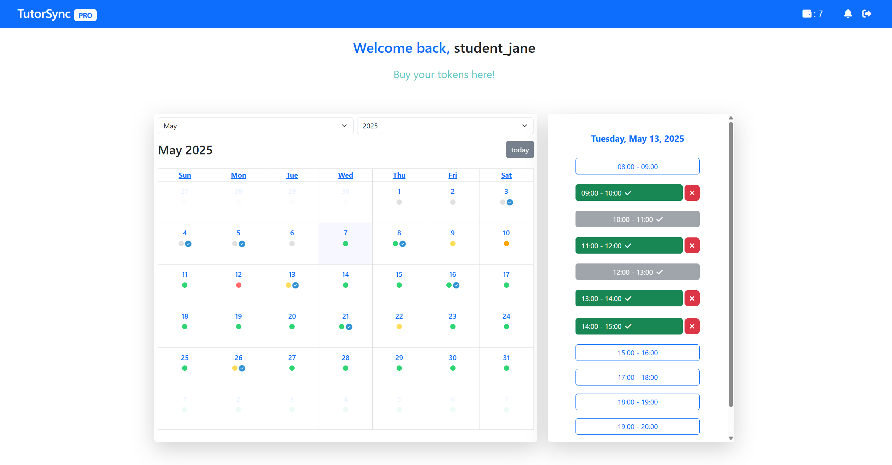
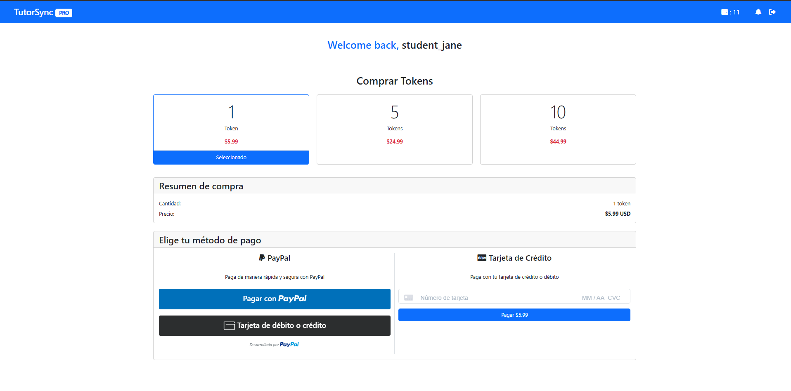
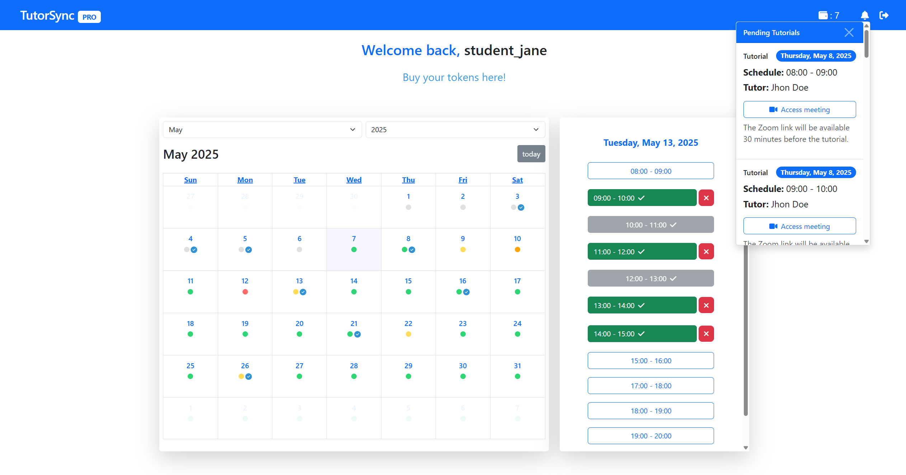
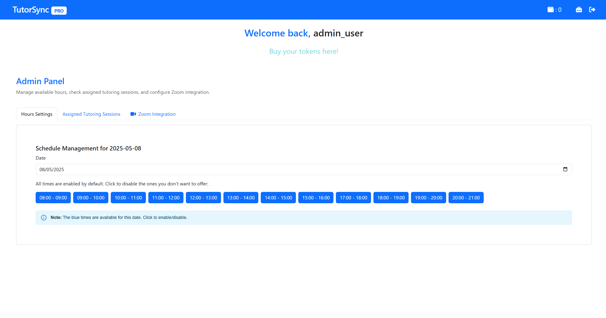
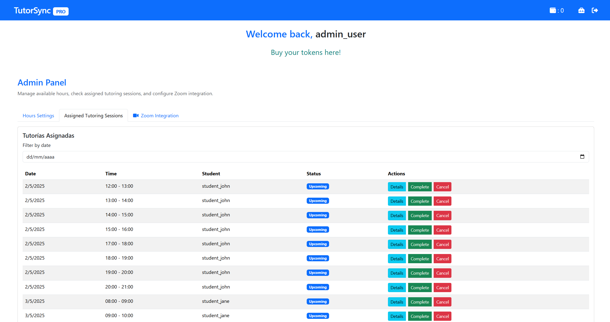

# TutorSync (Prototipo) 

TutorSync es un prototipo de plataforma educativa diseñada para facilitar la creación y gestión de tutoriales, conectando instructores con estudiantes a través de una experiencia de aprendizaje interactiva y dinámica. Este proyecto conceptual presenta una solución todo-en-uno que permitiría a los educadores compartir su conocimiento y habilidades mediante sesiones en vivo, contenido a demanda, y herramientas de seguimiento de progreso, mientras que los estudiantes disfrutarían de un aprendizaje personalizado con acceso a recursos de calidad y comunicación directa con expertos en diversas materias. Como prototipo, TutorSync demuestra cómo se podría simplificar el proceso educativo y ofrecer herramientas de monetización para que los instructores puedan generar ingresos a partir de su experiencia y dedicación.

## 📸 Capturas de pantalla

<div align="center">
  
  
</div>

<div align="center">
  
  
</div>

<div align="center">
  
  
</div>

## ✨ Características Propuestas

-   📹 Sesiones de aprendizaje en vivo mediante integración con Zoom
-   💰 Sistema de pago integrado con Stripe y PayPal
-   📚 Gestión de contenido educativo para crear y organizar tutoriales
-   📱 Interfaz amigable y adaptable a diferentes dispositivos
-   📊 Panel de control para instructores y estudiantes

## 🛠️ Tecnologías

### Frontend

-   React 19
-   Vite 6
-   Bootstrap 5.3
-   @fullcalendar/react - Para gestión de calendarios y eventos
-   @stripe/react-stripe-js - Integración de pagos con Stripe
-   @paypal/react-paypal-js - Integración de pagos con PayPal
-   axios - Para peticiones HTTP

### Backend

-   Node.js
-   MySQL2 - Para conexión con la base de datos
-   @zoom/appssdk - Integración con Zoom
-   Stripe - Procesamiento de pagos
-   JWT - Autenticación de usuarios
-   dotenv - Gestión de variables de entorno
-   cors - Para gestión de solicitudes cross-origin

## 📋 Requisitos previos

-   Node.js (v18.0.0 o superior recomendado para compatibilidad con React 19)
-   MySQL (v8.0 o superior recomendado)
-   NPM (v9.0.0 o superior)
-   Cuentas de servicio para:
    -   Stripe (necesario para procesamiento de pagos)
    -   PayPal (alternativa de procesamiento de pagos)
    -   Zoom (para sesiones de video)

## 🚀 Instalación

1. **Clona este repositorio:**

    ```bash
    git clone https://github.com/tu-usuario/tutosync.git
    cd tutosync
    ```

2. **Instala las dependencias en la raíz, backend y frontend:**

    ```bash
    # En la raíz del proyecto
    npm install

    # Instala dependencias del frontend
    cd frontend
    npm install

    # Instala dependencias del backend
    cd ../backend
    npm install

    # Vuelve a la raíz
    cd ..
    ```

3. **Configura la base de datos:**

    - Crea una base de datos MySQL
    - Importa la estructura desde backend/database.sql

    ```bash
    mysql -u tu_usuario -p tu_base_de_datos < backend/database.sql
    ```

4. **Configura las variables de entorno:**

    - Copia y renombra los archivos .env.example tanto en backend como en frontend:

    ```bash
    # Para el backend
    cp backend/.env.example backend/.env

    # Para el frontend
    cp frontend/.env.example frontend/.env
    ```

    - Actualiza los valores de los archivos .env con tus credenciales de servicios

## 🏃‍♂️ Ejecución

Para ejecutar la aplicación localmente:

```bash
npm run dev
```

Este comando ejecutará concurrentemente tanto el servidor backend como el cliente frontend.
